# 팀 소개

저희 팀은 아래 세 명의 인원으로 구성되어 있습니다.

- 노예준: 컴퓨터과학과 / 희망 진로: 인공지능 연구원
- 공률하: 창의기술경영, 3학년(24학번) / 희망 진로: 금융권, IT 계열
- 이지원: 대기과학·인공지능융합심화전공 / 희망 진로: 창업, 컨설팅

## GitHub 협업 과정

### 브랜치 보호 설정

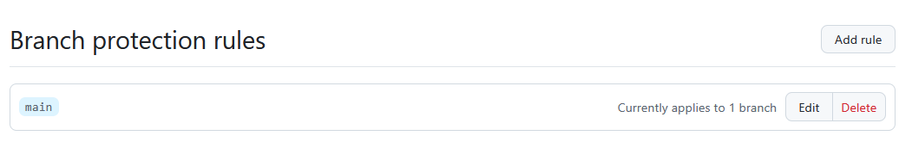

### main 브랜치 직접 push 거부

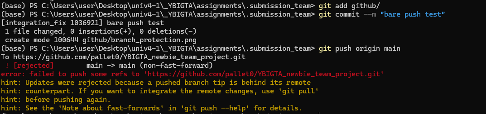

### Pull Request 리뷰 및 병합

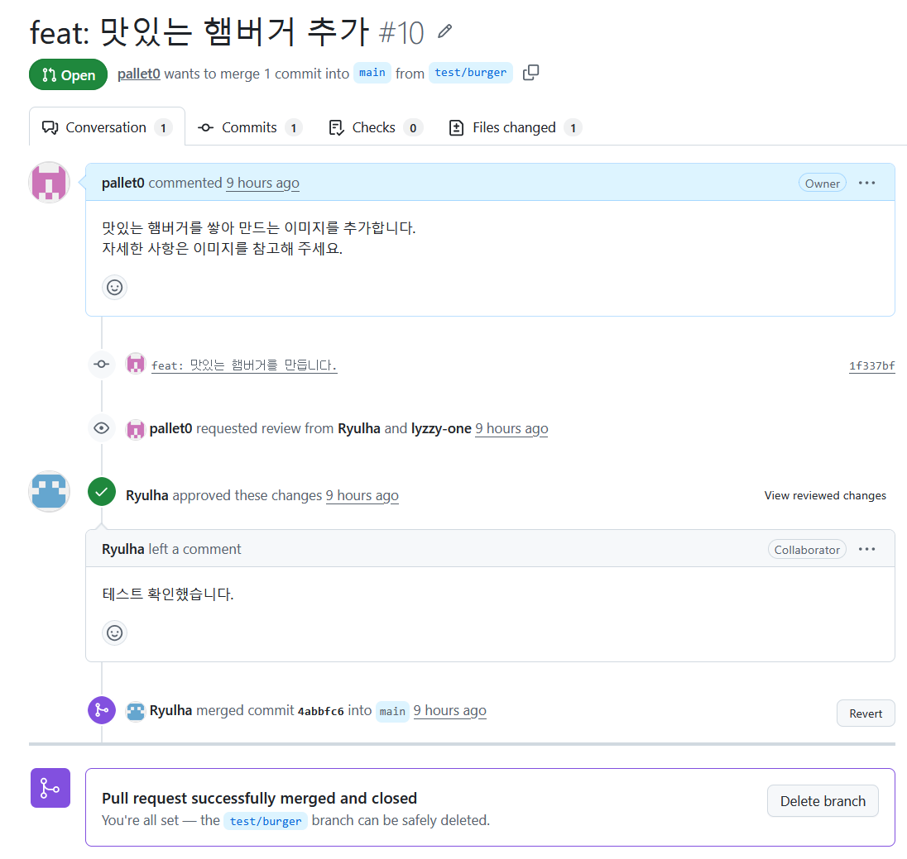

## Web 과제 실행 방법

```bash
pip install -r requirements.txt
uvicorn app.main:app --reload
```

---

# 성심당 본점 리뷰 분석 (EDA & FE, 시각화)

대전 성심당 본점에 대한 카카오맵(`reviews_kakaomap.csv`), 다이닝코드(`reviews_diningcode.csv`),
네이버맵(`reviews_navermap.csv`) 리뷰를 개별 분석한 뒤 사이트간 비교분석을 수행했습니다.

## 크롤링 과제 실행 방법

### 카카오맵

- 대상 페이지: https://place.map.kakao.com/17733090#review
- 결과물: database/reviews_seongsimdang.csv (약 512개 리뷰 수집)
- 코드: review_analysis/crawling/kakaomap_crawler.py

#### &lt;작동 원리&gt;

카카오맵 리뷰는 페이지를 스크롤할 때마다 다음 리뷰가 추가로 불러와지는 레이지 로딩(무한 스크롤) 방식이라, 단순 HTTP 요청으로는 전체를 받아올 수 없습니다. 그래서 아래 순서로 동작합니다.

1. 브라우저 실행 (start_browser)
Selenium으로 크롬을 띄우고 성심당 본점 페이지로 (—headless 옵션을 켜면 창 없이 백그라운드 실행 가능)
2. 후기 탭 이동 (_go_to_review_tab)
리뷰 목록(ul.list_review)이 화면에 없으면 '후기' 탭을 클릭해 리뷰 화면으로 이동
3. 스크롤하며 수집 (scrape_reviews + _scroll_step)
  - 마지막 리뷰 요소로 스크롤을 내려 다음 리뷰가 로딩되도록 트리거
  - 서버가 새 리뷰를 응답할 시간(약 2.2초)을 기다림
  - 목표 개수(target_count=500)에 도달할 때까지 반복
  - 스크롤해도 리뷰 수가 안 늘어나는 상황이 8회 연속 발생하면 실제 페이지 끝으로 판단하고 종료(끝인 척했다가 더 나오는 경우를 걸러내기 위함)
4. 파싱 (_parse_current_page)
현재 화면의 HTML을 BeautifulSoup으로 읽어 리뷰 하나(li)마다 아래 3개 항목을 추출
  - 별점 (_extract_rating): starred_grade 안에서 숫자 형태("5.0")인 값만 골라냅니다. ("별점" 같은 텍스트는 제외)
  - 날짜 (span.txt_date)
  - 리뷰 본문 (_extract_content): desc_review에서 '더보기/접기' 버튼 텍스트는 제거하고 순수 본문만 가져옴
  - 중복 제거: (날짜, 내용) 쌍을 seen 집합에 기록해, 스크롤 중 이미 수집한 리뷰가 다시 파싱돼도 중복 저장되지 않습니다.
5. 저장 (save_to_database)
수집한 리뷰를 pandas DataFrame으로 만들어 reviews_seongsimdang.csv(utf-8-sig 인코딩)로 저장하고 브라우저를 종료
#### 의존성

- selenium (+ 크롬 / ChromeDriver)
- beautifulsoup4
- pandas

### 네이버맵

크롤링 사이트: 성심당 본점 - 네이버 리뷰
https://m.place.naver.com/restaurant/11871325/review/visitor?entry=ple&reviewSort=recent

데이터 형식: CSV
- rating: 별점 (ex- 4.5)
- date: 리뷰 작성일 (ex- 2000년 1월 1일 월요일)
- content: 리뷰 본문 텍스트
- visit_time: 방문 시간대 (ex- 아침에 방문)
- reservation: 예약 여부(ex- 예약 없이 이용)
- wait_time: 대기 시간 (ex- 30분 이상)

수집 데이터 개수: 539개
본문 텍스트가 존재하지 않는 리뷰를 제외하고 500개 이상의 데이터가 수집되도록 570건을 로드하였고, 그 중 539개가 저장되었습니다.

#### &lt;크롤러 작동 원리&gt;

네이버 플레이스는 짧은 시간 반복 접속시 보안 인증 화면을 띄우는 등 자동화 크롤링에 민감하게 반응합니다. 이에 따른 오류를 방지하기 위해 undetected-chromedriver와 모바일 User-Agent 위장으로 탐지를 우회하였습니다. 또한, 더보기 버튼을 클릭해야 다음 리뷰를 로드할 수 있는 형식이기 때문에 리뷰 탭 URL로 바로 접속해 해당 버튼을 랜덤한 간격으로 클릭하며 리뷰를 수집합니다.

1. 크롬 브라우저 실행 및 접속 (start_browser)
- undetected-chromedriver로 크롬을 실행해 셀레니움 자동화 흔적을 감춥니다.
- User Agent를 모바일(iPhone Safari)로 위장해, 모바일 전용 페이지에 접속합니다.
- 리뷰 탭을 따로 클릭하지 않고 리뷰 탭 URL로 바로 접속해 클릭 단계를 생략하였습니다.
> 참고사항: undetected-chromedriver는 기본적으로 설치된 크롬 버전을 자동 인식하지만, 자동 인식이 실패하거나 버전 불일치 오류가 날 경우 version_main에 실제 크롬 버전을 직접 지정할 수 있습니다.

2. 리뷰 목록 로드 및 수집 (scrape_reviews)
1) 대기
- 리뷰 아이템이 화면에 나타날 때까지 최대 10초 대기합니다. (WebDriverWait)
2) 리뷰 로드
- “더보기” 텍스트를 포함한 버튼을 찾아 반복 클릭해 min_count(570개 이상)에 도달할 때까지 리뷰를 수집하고, 버튼을 3번 연속 찾지 못하면 종료합니다.
- 매 클릭 전후로 랜덤한 시간만큼 대기하고, 일반 클릭이 실패할 경우 Enter키를 사용합니다.
3) 리뷰 파싱
- 리뷰 본문: 리뷰 끝에 붙는 “더보기”글자를 제거합니다.
- 별점: 텍스트에서 숫자만 추출합니다.
- 날짜: &lt;time&gt;태그는 연도가 없어 사용하지 않고, 같은 블록에서 “년”과 “월”이 모두 포함된 문자열을 찾아 사용합니다.
- 방문 시간대 / 예약 여부 / 대기 시간: 태그의 텍스트에 “방문”, “예약”, “대기” 키워드가 포함되는지를 기준으로 분류합니다.
> 참고사항: 본문이 비어있는 데이터는 제외하고 리스트에 담습니다.

3. 저장 및 종료 (save_to_database)
- 파싱된 리뷰 리스트를 database/reviews_navermap.csv에 UTF-8 인코딩으로 저장한 후, 브라우저 창을 닫습니다.

### 다이닝코드

- 대상 페이지: https://www.diningcode.com/profile.php?rid=LtMjLaf0kZJC
- 결과물: database/reviews_diningcode.csv (334개 리뷰 수집)
- 코드: review_analysis/crawling/diningcode_crawler.py

#### &lt;작동 원리&gt;

다이닝코드 리뷰는 “더보기” 버튼을 클릭할 때마다 다음 리뷰가 추가로 불러와지는 방식이라, Selenium으로 버튼을 반복해서 클릭해 모든 리뷰를 화면에 불러온 뒤 수집합니다. 아래 순서로 동작합니다.

1. 브라우저 실행 (start_browser)
- Selenium으로 크롬 브라우저를 실행합니다.

2. 리뷰 페이지 접속 및 로드 (scrape_reviews)
- 성심당 다이닝코드 페이지에 접속한 뒤 2초 동안 기다립니다.
- div_more_review 요소가 화면에 표시되는 동안 More__Review__Button을 반복해서 클릭합니다.
- 버튼을 클릭할 때마다 다음 리뷰가 로드되도록 1초 동안 기다립니다.
- 더 불러올 리뷰가 없어 div_more_review가 화면에서 사라지면 반복을 종료합니다.
- 예상하지 못한 무한 반복을 막기 위해 최대 1000회까지만 실행합니다.

3. 리뷰 파싱
- 화면에 불러온 latter-graph 요소를 리뷰 단위로 수집합니다.
- 별점: total_score의 텍스트에서 “점”을 제거한 뒤 float로 변환합니다.
- 날짜: date의 텍스트를 추출합니다.
- 리뷰 본문: review_contents의 첫 번째 텍스트를 추출하고, 본문이 없으면 빈 문자열로 저장합니다.

4. 저장 및 종료 (save_to_database)
- 수집한 리뷰를 rating, date, content 컬럼의 pandas DataFrame으로 만듭니다.
- database/reviews_diningcode.csv에 utf-8-sig 인코딩으로 저장합니다.
- 리뷰 수집이 끝나거나 오류가 발생하면 브라우저를 종료합니다.

#### 의존성

- selenium (+ 크롬 / ChromeDriver)
- pandas

### 실행 명령

저장소 루트에서 아래 명령을 실행합니다.

```bash
# 카카오맵
python -m review_analysis.crawling.main --output_dir database --crawler kakaomap

# 네이버맵
python -m review_analysis.crawling.main --output_dir database --crawler navermap

# 다이닝코드
python -m review_analysis.crawling.main --output_dir database --crawler diningcode

# 전체 크롤러
python -m review_analysis.crawling.main --output_dir database --all
```

## 실행 방법

```bash
# 전처리 / FE : database/preprocessed_reviews_kakaomap.csv 생성
cd review_analysis/preprocessing
python main.py --output_dir ../../database --all

# 시각화 : review_analysis/plots/*.png 생성
cd ../..
python -m review_analysis.visualization.eda_plots
python -m review_analysis.visualization.comparison_plots
python -m review_analysis.visualization.comparison_all_sites
```

## 데이터 개요

| | 카카오맵 (성심당 본점) | 다이닝코드 |
|---|---|---|
| 원본 행 수 | 512 | 334 |
| 컬럼 | `rating`, `date`, `content` | `rating`, `date`, `content` |
| 수집 기간 | 2022-11-21 ~ 2026-07-16 | 2016-08-15 ~ 2026-07-27 |
| 별점 단위 | 1.0 ~ 5.0 (정수) | 2.0 ~ 5.0 (0.5 단위 포함) |
| 날짜 형식 | `2026.07.01.` | `2025년 11월 9일`, `7월 2일`, `4시간 전` 혼재 |

---

# 1. EDA — 개별 사이트 분석

## 1-1. 카카오맵 (성심당 본점)

### 별점 분포
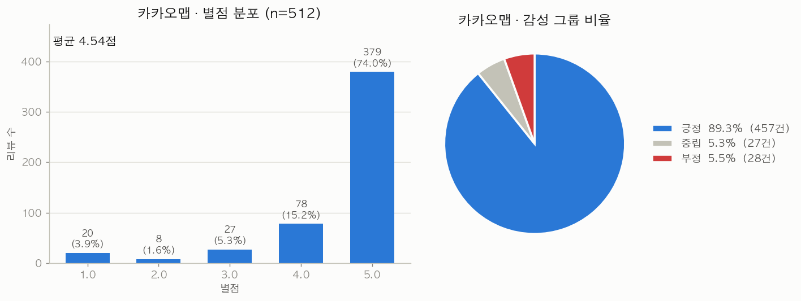

- 평균 4.54점, 5점이 74.0%(379건) 로 전형적인 J자형(극단 편향) 분포입니다.
- 4점 이상 긍정 리뷰가 89.3%인 반면, 1~2점 부정 리뷰도 5.5%(28건) 존재합니다.
  특이한 점은 2점(8건)보다 1점(20건)이 더 많다는 것으로, 불만이 있는 리뷰어는 중간 점수를 주지 않고
  곧바로 최저점을 주는 경향이 보입니다.

### 텍스트 길이 분포
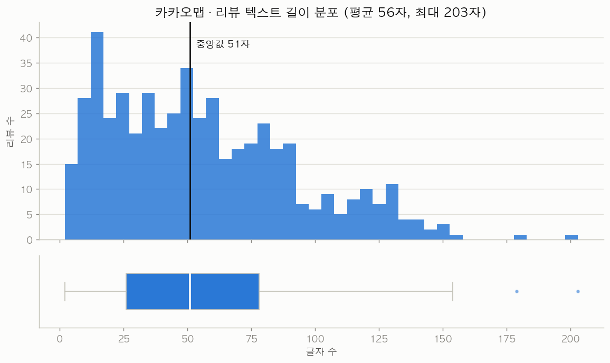

- 중앙값 51자, 평균 56자, 최대 203자로 짧은 단문 리뷰가 대부분입니다.
- 오른쪽 꼬리가 긴 우편포(right-skewed) 형태이며, 25자 부근에 봉우리가 하나 더 있습니다
  ("맛있어요", "빵이 맛있습니다" 류의 한 줄 리뷰 군집).

### 날짜 분포
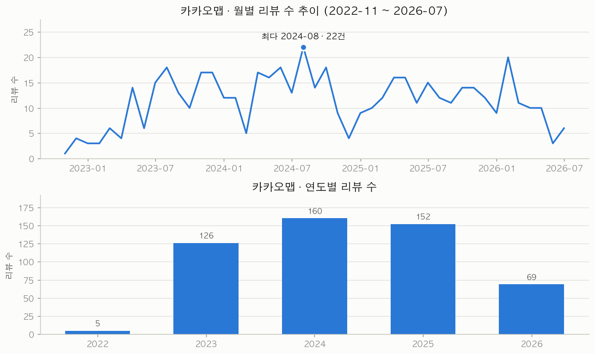

- 2022년 11월부터 리뷰가 시작되며, 2023년 이후 월 10~20건 수준으로 안정적입니다.
- 연도별로는 2023년 126건 → 2024년 160건 → 2025년 152건 → 2026년 69건(7월까지)입니다.
- 주의: 마지막 달(2026-07)은 수집 시점에 잘린 구간이라 실제 감소가 아닙니다.

### 이상치
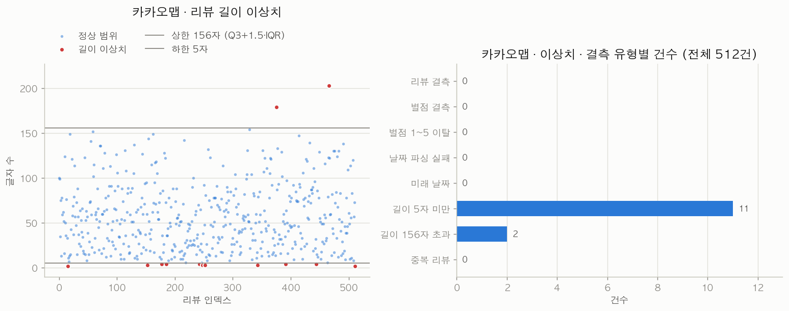

카카오맵 데이터는 크롤러 단계에서 이미 정제되어 결측치·별점 범위 이탈·날짜 파싱 실패·미래 날짜·중복이 모두 0건입니다.
실제로 발견된 이상치는 텍스트 길이뿐입니다.

| 유형 | 건수 | 예시 |
|---|---|---|
| 5자 미만 (정보량 없음) | 11 | `ㅎㅎ`, `애용`, `갓심당`, `ㄹ 먼` |
| 156자 초과 (Q3+1.5·IQR) | 2 | 웨이팅 시간·메뉴별 후기를 나열한 장문 리뷰 |

## 1-2. 다이닝코드

### 별점 분포
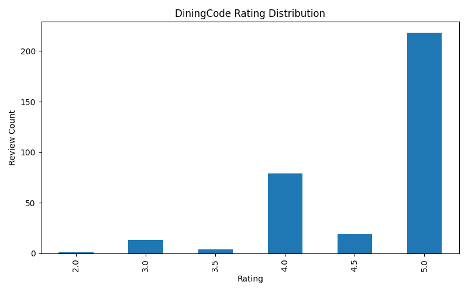

- 평균 4.63점으로 카카오맵보다 높지만, 5점 비율은 65.3% 로 오히려 낮습니다.
  다이닝코드는 0.5점 단위(3.5점 4건, 4.5점 19건) 를 허용해 4~5점 사이가 세분화되기 때문입니다.
- 1점 리뷰가 0건이고 최저가 2점(1건)이라, 카카오맵보다 부정 리뷰가 거의 없는 구조입니다(부정 0.3%).

### 텍스트 길이 분포
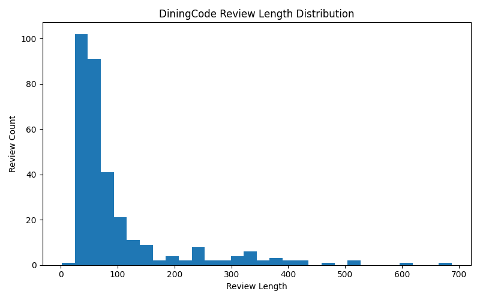
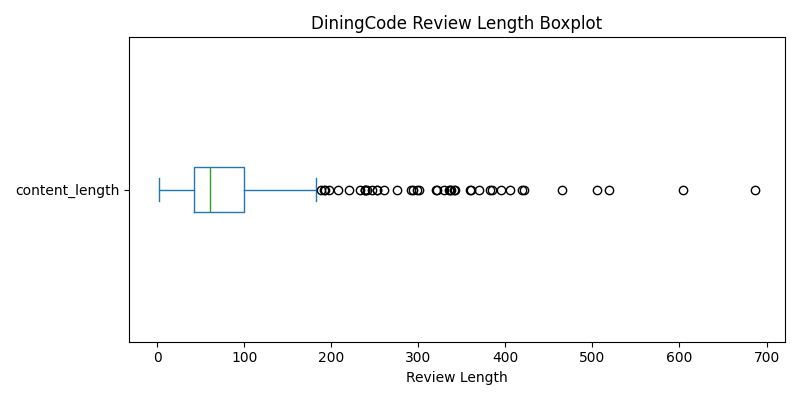

- 중앙값 60자지만 평균은 97자, 최대 681자로 카카오맵보다 훨씬 장문 편향입니다.
- "줄서기: … / 주문팁: … / 튀김소보로: …"처럼 항목을 나눠 쓴 리뷰 양식이 존재해 분포의 오른쪽 꼬리가 매우 깁니다.

### 날짜 분포
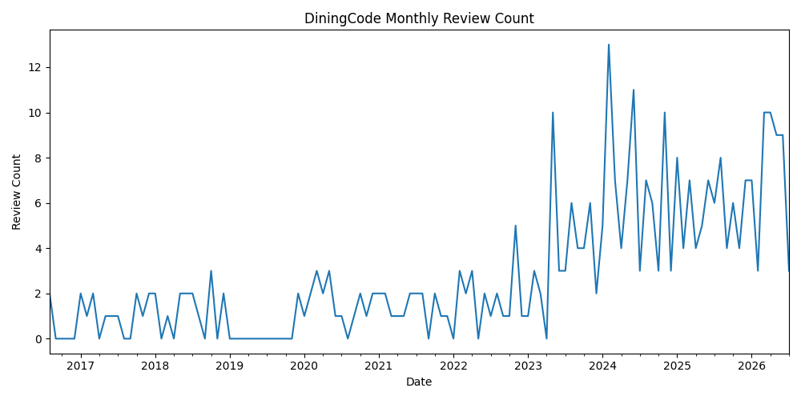

- 2016년까지 거슬러 올라가 수집 기간이 카카오맵보다 6년 이상 깁니다.
- 2022년까지는 연 20건 내외로 희박하다가 2023년(44건)부터 급증합니다.
- 날짜 형식이 세 가지로 섞여 있어(`2025년 11월 9일` / `7월 2일` / `4시간 전`) EDA 단계에서 아래 규칙으로 파싱했습니다.
  - 연도가 없으면 2026년을 붙여 절대 날짜로 변환합니다.
  - `N시간 전` 같은 상대 표기는 파싱 실패 값으로 처리해 날짜 분포에서 제외합니다.

### 이상치
| 유형 | 건수 |
|---|---|
| 리뷰 본문 결측 | 14 |
| 184자 초과 (Q3+1.5·IQR) | 41 |
| 5자 미만 | 1 |
| 날짜 파싱 실패 | 1 |
| 별점 결측 / 범위 이탈 / 미래 날짜 / 중복 | 0 |

카카오맵과 달리 별점만 남기고 본문이 비어 있는 리뷰(14건) 와 장문 이상치(41건, 전체의 12.3%) 가 뚜렷합니다.

---

# 2. 전처리 / FE 결과

`review_analysis/preprocessing/kakaomap_processor.py`의 `KakaomapProcessor`가
`BaseDataProcessor`를 상속해 구현되어 있고, 결과는 `database/preprocessed_reviews_kakaomap.csv`
(499행 × 118컬럼)로 저장됩니다.

```
[KakaomapProcessor] 512행 -> 499행
  - 결측치 제거: 0행
  - 중복 리뷰 제거: 0행
  - 별점 범위(1.0~5.0) 이탈 제거: 0행
  - 날짜 파싱 실패 제거: 0행
  - 날짜 범위(2010-01-01~2026-07-16) 이탈 제거: 0행
  - 너무 짧은 리뷰 제거(<5자): 11행
  - 너무 긴 리뷰 제거(>156자, IQR 1.5 fence): 2행
  - 불용어 제거 후 빈 리뷰 제거: 0행
  - TF-IDF 벡터화: 499개 리뷰 x 100개 term
```

### 2-1. 결측치 처리
- 팀 공통 스키마(`rating/date/content`) 중 본문 컬럼만 `review`로 바꿔 내부 처리 이름을 통일했습니다.
- 공백만 있는 리뷰(`" "`)도 결측으로 간주한 뒤, `rating`·`date`·`review` 중 하나라도 비면 행을 제거합니다.
- 카카오맵 원본에는 결측이 없어 실제 제거는 0건이지만, 규칙은 코드에 구현되어 있습니다.

### 2-2. 이상치 처리
| 항목 | 규칙 | 결과 |
|---|---|---|
| 중복 | `(date, review)` 동일 행 제거 | 0행 |
| 별점 | 1.0~5.0 범위 밖 제거 | 0행 |
| 날짜 | `%Y.%m.%d` 파싱 실패 제거 → 2010-01-01 이전/크롤링 시점 이후 제거 | 0행 |
| 텍스트 길이 | 5자 미만 제거 / Q3+1.5·IQR(=156자) 초과 제거 | 13행 |

길이 상한을 고정값이 아니라 IQR fence로 계산했기 때문에, 데이터가 바뀌어도 같은 코드가 그대로 동작합니다.

### 2-3. 텍스트 데이터 전처리
1. 줄바꿈(`\n`)을 공백으로 치환 — 원본 리뷰는 여러 줄로 작성된 경우가 많습니다.
2. 한글·영문·숫자·공백을 제외한 모든 특수문자와 이모지 제거 (`🥯`, `✔️`, `❤️` 등).
   단독 자음·모음(`ㅋㅋ`, `ㅠㅠ`)도 이 단계에서 함께 제거됩니다.
3. 연속 공백을 하나로 정규화 → `review_clean`
4. 공백 기준 토큰화 후 조사 제거(최대 2회, `평일에도` → `평일`) + 불용어 제거(`정말`, `너무`, `그냥` 등 약 70개) → `tokens`
   - `튀김소보로`, `망고시루`, `보문산메아리` 같은 고유명사는 보호 목록에 넣어 조사처럼 끝나도 원형을 유지합니다.
     (보호하지 않으면 `튀김소보로`의 `로`가 조사로 잘려 `튀김소보`가 됩니다.)
   - 형태소 분석기(konlpy 등) 없이도 재현 가능하도록 규칙 기반으로 구현했습니다. 대신 `맛있어요`/`맛있고`/`맛있음`이
     서로 다른 토큰으로 남는 한계가 있습니다.

### 2-4. 파생 변수
| 컬럼 | 설명 |
|---|---|
| `year`, `month`, `year_month`, `quarter` | 시계열 분석용 날짜 파생 |
| `weekday`, `weekday_name`, `is_weekend` | 요일(0=월) / 한글 요일 / 주말 여부 — 주말 작성 비율 29.9% |
| `review_len`, `clean_len`, `word_count` | 원문 길이 / 정제 후 길이 / 토큰 수(평균 11.0개) |
| `emoji_count` | 특수문자 제거 이전에 센 이모지 개수 — 48건의 리뷰가 이모지를 포함 |
| `rating_group` | 긍정(4~5) 445건 / 중립(3) 27건 / 부정(1~2) 27건 |
| `mentions_wait` | 웨이팅·대기·줄서기 언급 여부 — 성심당 리뷰의 핵심 화두로, 20.0% 의 리뷰가 해당 |

### 2-5. 텍스트 벡터화
- `tokens`를 대상으로 TF-IDF(`max_features=100`, `min_df=2`)를 적용하고,
  `tfidf_{단어}` 형태의 100개 컬럼을 CSV에 함께 저장했습니다.
- 평균 가중치 상위 term: `성심당`(0.085), `대전`(0.072), `사람`(0.058), `가격`(0.050), `맛있어요`(0.044),
  `가성비`(0.037), `웨이팅`(0.032).
- 상호명·지역명이 상위를 차지하는 것은 자연스럽지만, 그 바로 다음이 `사람`·`가격`·`웨이팅` 이라는 점이
  성심당 리뷰의 성격(맛보다 혼잡도와 가성비를 먼저 이야기함)을 보여줍니다.

## 다이닝코드 전처리 / FE

`review_analysis/preprocessing/diningcode_processor.py`의 `DiningCodeProcessor`가
`BaseDataProcessor`를 상속해 구현되어 있고, 결과는 `database/preprocessed_reviews_diningcode.csv`
(309행 × 3162컬럼)로 저장됩니다.

```
[DiningCodeProcessor] 334행 -> 309행
  - 별점 결측 / 범위(1.0~5.0) 이탈 제거: 0행
  - 리뷰 본문 결측 제거: 14행
  - 텍스트 길이 범위(30~400자) 이탈 제거: 10행
  - 날짜 파싱 실패 제거: 1행
  - 미래 날짜 제거: 0행
  - TF-IDF 벡터화: 309개 리뷰 x 3157개 term
```

### 결측치 처리
- `rating`을 숫자형으로 변환할 수 없는 값은 결측치로 바꾼 뒤 제거합니다. 실제 제거된 행은 0개입니다.
- `content`의 앞뒤 공백을 제거하고 빈 문자열을 결측치로 바꾼 뒤, 본문이 없는 리뷰 14개를 제거합니다.
- 날짜를 변환할 수 없는 값은 결측치로 처리하며, 상대 날짜 형식인 리뷰 1개가 제거되었습니다.

### 이상치 처리
| 항목 | 규칙 | 결과 |
|---|---|---|
| 별점 | 1.0~5.0 범위 밖 제거 | 0행 |
| 텍스트 길이 | 30자 미만 또는 400자 초과 제거 | 10행 |
| 날짜 | `%Y년 %m월 %d일` 파싱 실패 제거 → 실행일 이후 제거 | 1행 / 0행 |

- 연도가 없는 `7월 2일` 형식에는 2026년을 붙인 뒤 날짜로 변환합니다.
- 전처리 후 날짜 범위는 2016-08-15 ~ 2026-07-13이며, 전체 334개 리뷰 중 309개가 저장됩니다.

### 텍스트 데이터 전처리
1. 리뷰 본문의 앞뒤 공백을 제거합니다.
2. 한글·영문·숫자·공백을 제외한 특수문자를 공백으로 치환합니다.
3. 연속된 공백을 하나로 합친 뒤 앞뒤 공백을 다시 제거해 `cleaned` 컬럼에 저장합니다.

### 파생 변수
| 컬럼 | 설명 |
|---|---|
| `content_length` | 원문 리뷰의 글자 수 — 전처리 후 평균 88.5자 |

### 텍스트 벡터화
- 정제된 `cleaned` 컬럼에 `TfidfVectorizer`를 적용하고, `tfidf_{단어}` 형식의 3157개 컬럼을 결과 CSV에 함께 저장했습니다.
- 평균 가중치 상위 term: `성심당`(0.0351), `너무`(0.0278), `맛있어요`(0.0240), `빵이`(0.0197),
  `가격도`(0.0190), `정말`(0.0185), `좋아요`(0.0178), `대전`(0.0176).
- 상호명인 `성심당`이 가장 높은 비중을 차지했고, `맛있어요`·`좋아요`처럼 만족도를 직접 표현하는 단어가 상위에 나타났습니다.
  다만 별도 불용어 제거를 하지 않아 `너무`·`정말` 같은 일반 부사도 상위 term에 포함됩니다.

---

# 3. 비교분석

카카오맵은 위에서 만든 `preprocessed_reviews_kakaomap.csv`를 그대로 사용했고,
현재 비교분석 코드는 다이닝코드에 별도 전처리 규칙을 적용해 비교 가능한 상태(278건)로 맞췄습니다.

## 3-1. 별점 분포 비교
- 두 사이트 모두 5점이 73.7% 로 동일하지만, 그 아래가 다릅니다.
  카카오맵은 1점(4.0%)·3점(5.4%)에 꼬리가 있는 반면, 다이닝코드는 4점(22.7%)에 몰려 있고 1점이 없습니다.
- 카카오맵이 부정 리뷰를 더 많이 담고 있다는 뜻이며, 지도 앱 특성상 방문 직후 불만을 즉시 남기기 쉬운 반면
  맛집 큐레이션 서비스인 다이닝코드는 애초에 추천 의도로 작성된 리뷰가 많은 것으로 보입니다.

## 3-2. 키워드 비교
- 공통 상위 키워드: `성심당`, `대전`, `가격`, `사람`, `웨이팅`, `가성비` — 두 사이트 모두
  "맛" 자체보다 가격·혼잡도를 먼저 이야기합니다.
- `사람`은 두 사이트가 거의 같습니다(카카오맵 14.6% / 다이닝코드 14.7%). 혼잡도는 플랫폼과 무관한 공통 화두입니다.
- 카카오맵에서 상대적으로 강한 키워드: `평일`(5.8% vs 4.3%), `줄이`(5.4% vs 4.0%), `빵집`(5.6% vs 4.0%)
  → 언제 가야 덜 붐비는지에 대한 방문 타이밍 정보가 많습니다.
- 다이닝코드에서 상대적으로 강한 키워드: `가격`(23.7% vs 12.0%), `종류`(9.4% vs 3.0%),
  `유명한`(8.6% vs 2.0%), `튀김소보로`(7.2% vs 3.2%) → 개별 메뉴명과 가격을 구체적으로 나열하는 리뷰가 많습니다.
- 즉 같은 가게를 두고 카카오맵은 *"언제 가면 덜 기다리나"*, 다이닝코드는 *"무엇을 얼마에 먹었나"* 를 씁니다.

## 3-3. 토픽 비교
키워드 사전 기반으로 리뷰를 5개 주제로 분류하고, 가장 많이 언급된 주제를 대표 주제로 지정했습니다.

| 주제 | 카카오맵 (언급률) | 다이닝코드 (언급률) |
|---|---|---|
| 맛·제품 | 70.1% | 88.5% |
| 가격·가성비 | 28.1% | 43.9% |
| 웨이팅·혼잡 | 24.6% | 28.1% |
| 접근성·시설 | 12.8% | 12.2% |
| 서비스·직원 | 7.0% | 2.9% |

- 다이닝코드는 맛·가격 언급률이 압도적으로 높고, 대표 주제가 "맛·제품"인 리뷰가 80.2%입니다.
- 반대로 카카오맵은 "기타"가 16.2% 로 넓게 퍼져 있고 서비스·직원 언급률이 2배 이상 높습니다.
  불친절·응대 관련 불만이 카카오맵 쪽 저평점 리뷰에 집중되어 있기 때문으로, 3-1의 별점 분포 차이와 일관됩니다.

## 3-4. 시계열 비교
- 두 사이트가 모두 데이터를 가진 2022-11 ~ 2026-06 구간을 겹쳐 그렸습니다(수집 중 잘린 마지막 달은 제외).
- 카카오맵이 대체로 다이닝코드의 2배 수준을 유지하며, 2024년 8월에 월 22건으로 정점을 찍습니다.
- 두 선이 붙는 구간은 2024-02(12건 대 12건), 2024-11(9건 대 9건), 2026-03(10건 대 10건)입니다.
  특히 2024년 2월은 다이닝코드가 12건까지 치솟은 유일한 달로, 딸기시루 시즌과 시점이 맞물립니다.
- 반대로 2026년 2월에는 카카오맵만 20건으로 급등하고 다이닝코드는 3건에 그칩니다.
  같은 가게의 같은 시기라도 두 플랫폼의 리뷰 유입은 함께 움직이지 않습니다.

- 카카오맵은 월요일(16.0%)과 토요일(15.6%) 이 높습니다. 주말 방문 후기와 주말 직후 작성이 겹친 형태입니다.
- 다이닝코드는 월요일(18.7%)에 크게 쏠리고 목요일(9.7%)이 최저로, 요일 편차가 카카오맵보다 훨씬 큽니다.
  다만 다이닝코드는 연도가 없는 날짜(52건)를 추정해 채운 값이라 요일 분포에 오차가 섞여 있을 수 있습니다.

## 3-5. 리뷰 길이 비교
- 전처리 후에도 다이닝코드가 중앙값 53자 / 평균 61자로 카카오맵(47자 / 53자)보다 깁니다.
- 원본 기준으로는 차이가 훨씬 큽니다(평균 97자 vs 56자). 각 사이트의 IQR fence로 장문 이상치를 잘라내면서
  다이닝코드 쪽에서 41건이 제거되었기 때문입니다.

---

## 폴더 구조

이번 과제에서 추가된 부분만 표시했습니다(`*` 표시).

```
YBIGTA_newbie_team_project
├── database/
│   ├── __init__.py                            *
│   ├── reviews_kakaomap.csv                   # 카카오맵 크롤링 원본 (3회차)
│   ├── reviews_diningcode.csv                 # 다이닝코드 크롤링 원본 (3회차)
│   ├── reviews_navermap.csv                   # 네이버맵 크롤링 원본 (3회차)
│   └── preprocessed_reviews_kakaomap.csv      * 전처리/FE 결과
├── review_analysis/
│   ├── plots/                                 * EDA 및 비교분석 시각화 결과 이미지
│   ├── preprocessing/
│   │   ├── base_processor.py                  * (배포된 템플릿)
│   │   ├── example_processor.py               * (배포된 템플릿)
│   │   ├── kakaomap_processor.py              * KakaomapProcessor
│   │   └── main.py                            * PREPROCESS_CLASSES 등록
│   ├── visualization/                         * 그래프 생성 코드
│   │   ├── viz_common.py                      #   스타일 · 데이터 로더
│   │   ├── eda_plots.py                       #   개별 EDA 그래프
│   │   ├── comparison_plots.py                #   카카오맵·다이닝코드 비교
│   │   └── comparison_all_sites.py            #   세 사이트 통합 비교
│   └── crawling/                              # 크롤러 (3회차)
├── app/  ·  test/  ·  utils/                  # 1~2회차
├── README.md                                  *
└── requirements.txt
```

---

# 4. 네이버맵 EDA / FE

대전 성심당 본점에 대한 네이버맵(`reviews_navermap.csv`) 리뷰를 분석하였습니다.

## 데이터 개요

| | 네이버맵 (성심당 본점) |
|---|---|
| 원본 행 수 | 539 |
| 컬럼 | `rating`, `date`, `content`, `visit_time`, `reservation`, `wait_time` |
| 수집 기간 | 2026-04-19 ~ 2026-07-22 |
| 별점 단위 | 0.5 ~ 5.0 (0.5 단위 포함) |
| 날짜 형식 | `2026년 1월 1일 월요일` |

## 4-1. EDA

### 별점 분포
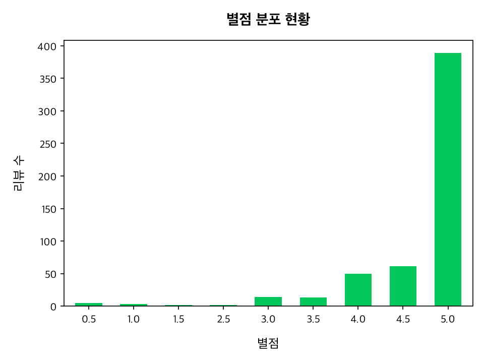

- 평균 4.68점, 5점이 72.2%(389건) 으로 압도적인 J자형(극단 편향) 분포입니다.
- 0.5 단위 별점(3.5, 4.5 등)도 함께 수집되어 있어 다른 사이트보다 세분화된 척도를 갖습니다.
- 1~2점대 저평점 리뷰는 5건(1.0점 3건, 1.5점 2건)으로 소수지만 존재하며, 0.5점(5건)까지 포함하면 극단적으로 낮은 평점을 준 리뷰가 10건 있습니다. 반면 2.0점은 0건으로, 낮은 평점을 줄 때는 애매한 중간값보다 최저점에 가까운 값을 택하는 경향이 보입니다.

### 텍스트 길이 분포
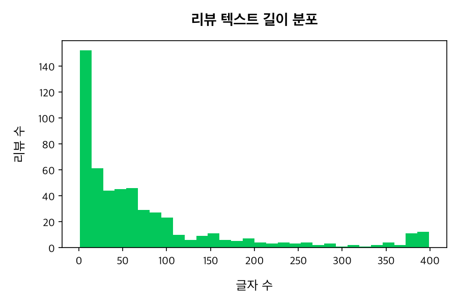
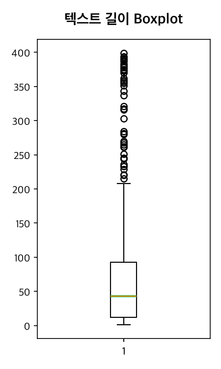

- 중앙값 43자, 평균 77.9자, 최대 399자로 평균이 중앙값보다 훨씬 커서 오른쪽 꼬리가 매우 긴(right-skewed) 분포입니다.
- 대부분의 리뷰가 50자 이하에 몰려 있고, 소수의 리뷰가 300~400자에 이르는 장문 후기(방문 팁, 메뉴 나열 등)라서 평균을 끌어올렸습니다.

### 이상치
- 별점 범위(0.5~5.0) 이탈, 결측치, 날짜 파싱 실패, 미래 날짜 이상치는 모두 0건으로 확인되어 원본 데이터가 비교적 깨끗합니다.
- 유일하게 발견된 이상치는 텍스트 길이로, 3자 미만의 정보량 없는 리뷰(`ㅎㅎ`, `짱` 등)가 다수 존재합니다.

| 유형 | 건수 |
|---|---|
| 결측치(별점/날짜/본문) | 0 |
| 별점 범위(0.5~5.0) 이탈 | 0 |
| 날짜 파싱 실패 / 범위(2015~오늘) 이탈 | 0 |
| 3자 미만 (정보량 없음) | 41 |

### 날짜 분포
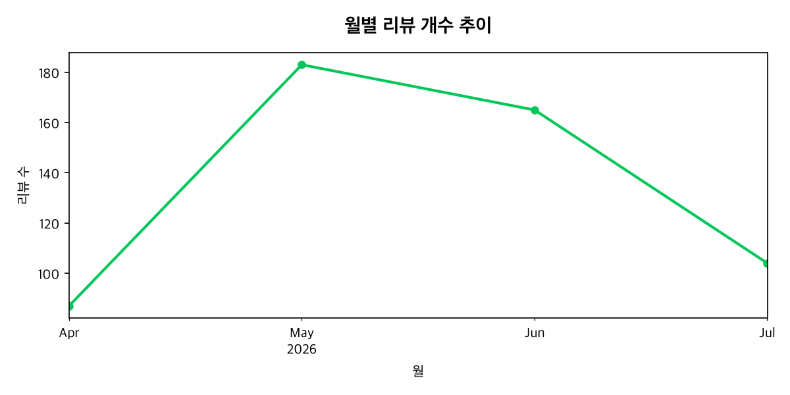
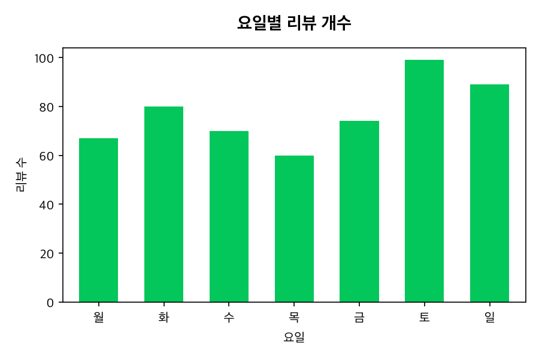

- 네이버맵에서 올해 4월부터 별점 기능을 제공하여 최신순으로 데이터 크롤링을 진행했습니다. 수집 기간은 2026-04-19 ~ 2026-07-22로, 다른 사이트보다 훨씬 짧고 최근 데이터에 집중되어 있습니다.
- 월별 리뷰 수는 4월 87건, 5월 183건, 6월 165건, 7월 104건으로 다시 감소합니다(4월과 7월은 수집 시점 기준으로 잘린 구간이라 실제 감소로 보기 어렵습니다).
- 요일별로는 토요일(99건) 과 일요일(89건) 이 가장 많고, 목요일(60건) 이 가장 적습니다. 주말 방문 후 리뷰를 남기는 경향이 뚜렷합니다.

### 범주형 변수 (visit_time / reservation / wait_time)
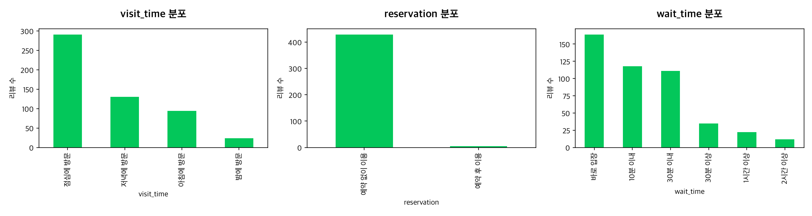
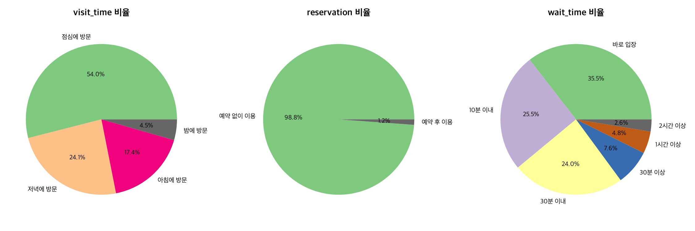

- visit_time: 점심 방문이 54.0%로 압도적이며, 저녁(24.1%), 아침(17.4%), 밤(4.5%) 순입니다.
- reservation: 예약 없이 이용이 98.8%로, 네이버맵 리뷰어 대부분은 워크인으로 매장을 방문했습니다.
- wait_time: 바로 입장이 35.5%로 가장 많지만, 10분 이내(25.5%)와 30분 이내(24.0%)를 합치면 절반 정도가 어느 정도 대기를 경험했습니다. 1시간 이상 대기(4.8%+2.6%=7.4%)도 드물지 않게 존재합니다.

### 범주형 변수 x 별점 관계
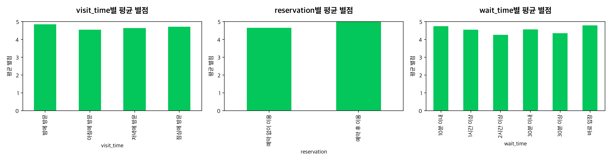
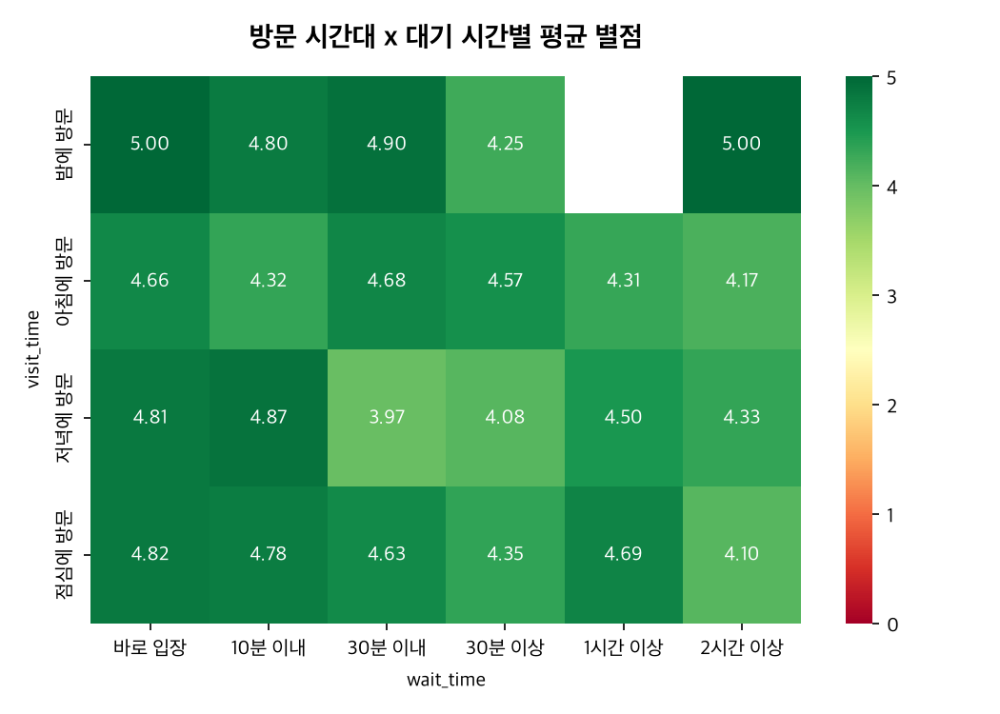
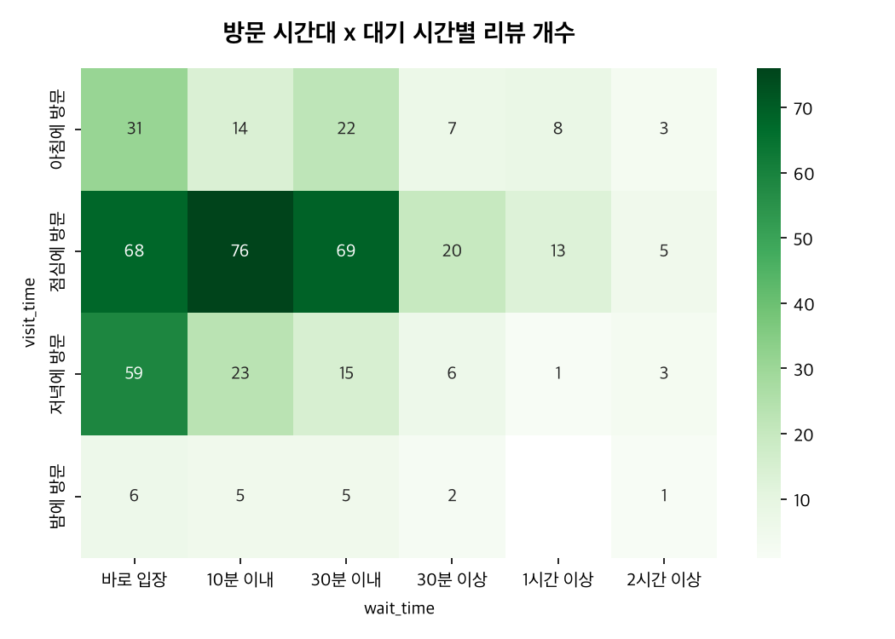

- 예약 후 이용한 리뷰는 평균 별점이 5.00점으로, 예약 없이 이용(4.65점)보다 높습니다. 다만 예약 이용은 전체의 1.2%뿐이라 표본이 매우 적습니다.
- 웨이팅 시간이 길수록 평균 별점이 대체로 낮아지는 경향이 있으나, 예외적으로 저녁 방문 + 30분 이내 대기 조합만 평균 3.97점으로 뚜렷하게 낮습니다(리뷰 15건). 같은 저녁 시간대라도 10분 이내 대기(4.87점)와는 큰 차이를 보여, 웨이팅 자체보다 특정 시점의 서비스 이슈가 반영됐을 가능성이 있습니다.

### 요일 x 웨이팅 시간 관계
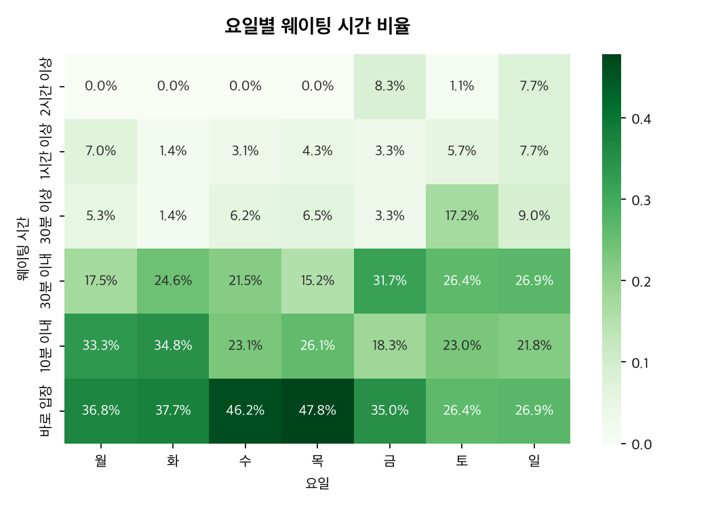

- 수요일(46.2%)과 목요일(47.8%)은 바로 입장 비율이 가장 높아, 평일 중반에는 대기가 짧은 편입니다.
- 반대로 금요일은 30분 이내 대기 비율이 31.7%로 가장 높고, 토요일은 30분 이상 대기 비율(17.2%)이 다른 요일보다 눈에 띄게 높습니다. 주말로 갈수록 대기가 길어지는 패턴을 확인할 수 있습니다.

## 4-2. 전처리 / FE 결과

`review_analysis/preprocessing/navermap_processor.py`의 `NavermapProcessor`가
`BaseDataProcessor`를 상속해 구현되어 있고, 결과는 `database/preprocessed_reviews_navermap.csv`
(498행 × 111컬럼)로 저장됩니다.

```
[NavermapProcessor] 539행 -> 498행
  - 결측치(rating/date/content) 제거: 0행
  - 별점 범위(0.5~5.0) 이탈 제거: 0행
  - 날짜 파싱 실패 / 범위(2015-01-01~오늘) 이탈 제거: 0행
  - 너무 짧은 리뷰 제거(<3자): 41행
  - TF-IDF 벡터화: 498개 리뷰 x 100개 term
```

### 4-2-1. 결측치 처리
- `rating`, `date`, `content` 중 하나라도 결측이면 행을 제거합니다.
- `visit_time`, `reservation`, `wait_time`은 정보가 없을 뿐 리뷰 자체는 유효하므로, 제거하지 않고 `"정보없음"`으로 대체했습니다.
- 원본 데이터에는 결측치가 없어 실제 제거는 0건이었습니다.

### 4-2-2. 이상치 처리
| 항목 | 규칙 | 결과 |
|---|---|---|
| 별점 | 0.5~5.0 범위 밖 제거 (숫자 변환 실패 포함) | 0행 |
| 날짜 | `%Y년 %m월 %d일` 파싱 실패 제거 → 2015-01-01 이전/오늘 이후 제거 | 0행 |
| 텍스트 길이 | 3자 미만 제거 / 500자 초과 제거 | 41행 |

### 4-2-3. 텍스트 데이터 전처리
1. 한글·영문·숫자·공백을 제외한 특수문자·이모지 전부 제거(`🥖`, `👍🏻`, `‼️` 등)
2. 연속 공백을 하나로 정규화

### 4-2-4. 파생 변수
| 컬럼 | 설명 |
|---|---|
| `weekday` | 날짜에서 추출한 요일 (시계열 비교분석용) |
| `rating_zscore` | 전체 평균(4.68점) 대비 이 리뷰의 별점 표준화 점수 |
| `wait_time_minutes` | `wait_time` 범주를 분으로(중앙값) 수치화 (바로입장=0 ~ 2시간이상=120) |
| `is_reserved` | 예약 여부 이진화 (예약 없이 이용=0, 예약 후 이용=1) |

### 4-2-5. 텍스트 벡터화
- 전처리된 `content`를 대상으로 TF-IDF(`max_features=100`)를 적용하고, `tfidf_{단어}` 형태의 100개 컬럼을 CSV에 함께 저장했습니다.
- 평균 가중치 상위 term: `성심당`(0.0997), `맛있어요`(0.0784), `좋아요`(0.0605), `너무`(0.0502), `대전`(0.0340), `역시`(0.0301), `많이`(0.0288), `빵이`(0.0283), `사람이`(0.0282), `웨이팅`(0.0279).
- 상호명·지역명(`성심당`, `대전`)이 상위를 차지하는 것은 자연스럽지만, 그 바로 다음이 구체적인 맛 표현(`맛있어요`, `좋아요`)이라는 점이 카카오맵·다이닝코드와 대비되는 특징입니다(두 사이트는 `사람`, `가격`, `웨이팅` 같은 혼잡도·가격 언급이 먼저 등장). 네이버맵 리뷰는 상대적으로 직관적인 만족도 표현 위주로 짧게 작성되는 경향이 있습니다.
- 다만 불용어 제거를 별도로 하지 않아 `너무`, `역시`, `많이` 같은 일반적인 부사도 상위 10개 안에 포함되었습니다. 이후 비교분석에서 키워드 빈도를 더 뾰족하게 보려면 불용어 사전을 추가하는 것을 고려할 수 있습니다.

---

# 5. 세 사이트 통합 비교분석

세 사이트의 전처리 결과를 `rating`, `date`, `text` 형식으로 맞춘 뒤 비교했습니다.
키워드는 사이트마다 같은 정제 규칙을 적용하고, 전체 리뷰 중 해당 단어가 나온 리뷰의 비율로 계산했습니다.

| 사이트 | 분석 리뷰 수 | 수집 기간 | 평균 별점 |
|---|---:|---|---:|
| 카카오맵 | 499 | 2022-11-21 ~ 2026-07-16 | 4.54 |
| 다이닝코드 | 309 | 2016-08-15 ~ 2026-07-13 | 4.64 |
| 네이버맵 | 498 | 2026-04-19 ~ 2026-07-22 | 4.69 |

## 5-1. 별점 성향 비교

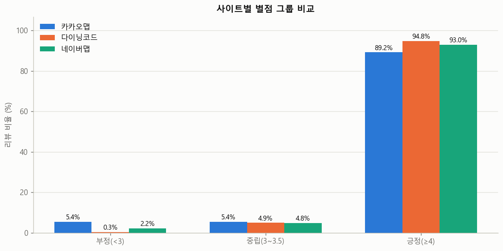

- 긍정 리뷰는 다이닝코드 94.8%, 네이버맵 93.0%, 카카오맵 89.2% 순입니다.
- 부정 리뷰는 카카오맵이 5.4%로 가장 많고, 네이버맵은 2.2%, 다이닝코드는 0.3%입니다.

## 5-2. 주요 키워드 비교

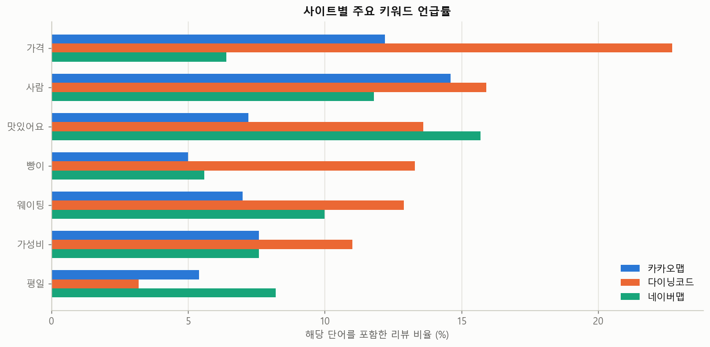

| 키워드 | 카카오맵 | 다이닝코드 | 네이버맵 |
|---|---:|---:|---:|
| 가격 | 12.2% | 22.7% | 6.4% |
| 사람 | 14.6% | 15.9% | 11.8% |
| 맛있어요 | 7.2% | 13.6% | 15.7% |
| 빵이 | 5.0% | 13.3% | 5.6% |
| 웨이팅 | 7.0% | 12.9% | 10.0% |
| 가성비 | 7.6% | 11.0% | 7.6% |
| 평일 | 5.4% | 3.2% | 8.2% |

- 다이닝코드는 가격과 메뉴에 대한 언급이 많습니다.
- 네이버맵은 `맛있어요`가 15.7%로 가장 높아 직접적인 맛 평가가 많습니다.
- 카카오맵은 `사람` 언급이 많아 혼잡도에 관심이 큰 편입니다.

## 5-3. 토픽 비교

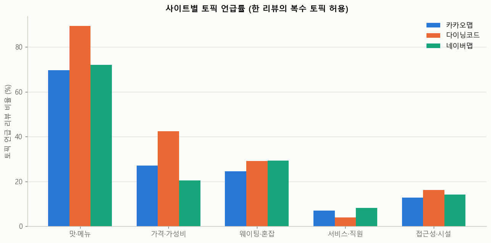

| 토픽 | 카카오맵 | 다이닝코드 | 네이버맵 |
|---|---:|---:|---:|
| 맛·메뉴 | 69.7% | 89.3% | 72.1% |
| 가격·가성비 | 27.1% | 42.4% | 20.5% |
| 웨이팅·혼잡 | 24.6% | 29.1% | 29.3% |
| 서비스·직원 | 7.0% | 3.9% | 8.2% |
| 접근성·시설 | 12.8% | 16.2% | 14.1% |

- 다이닝코드는 맛·메뉴와 가격·가성비 언급이 가장 많습니다.
- 네이버맵은 웨이팅·혼잡과 서비스·직원 언급이 가장 많습니다.
- 한 리뷰가 여러 토픽에 포함될 수 있어 비율의 합은 100%가 아닙니다.

## 5-4. 공통 기간 시계열 비교

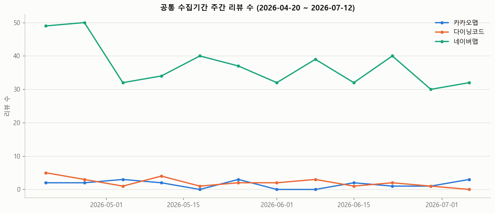

- 세 사이트에 모두 데이터가 있는 2026-04-20 ~ 2026-07-12를 비교했습니다.
- 주간 리뷰 수는 네이버맵 30~50건, 카카오맵 0~3건, 다이닝코드 0~5건입니다.
- 네이버맵 데이터가 최근 3개월에 집중되어 있으므로 플랫폼 전체 이용량 차이로 보기는 어렵습니다.

## 5-5. 리뷰 길이 비교

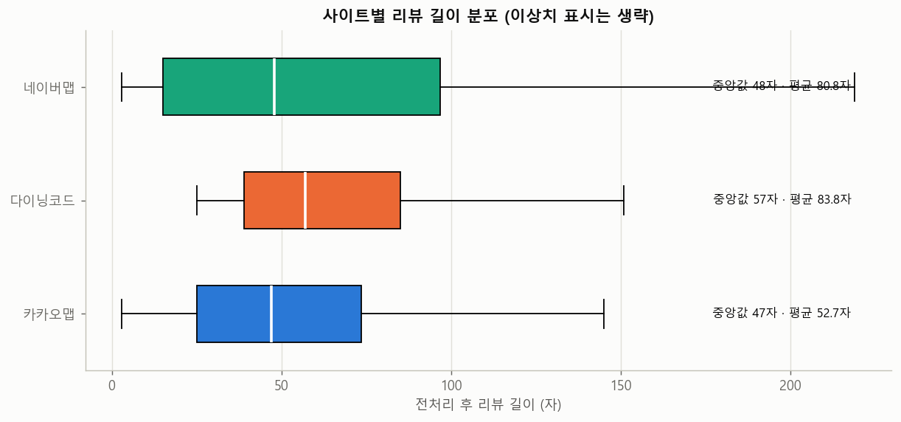

| 사이트 | 평균 | 중앙값 | Q1 ~ Q3 |
|---|---:|---:|---:|
| 카카오맵 | 52.7자 | 47자 | 25.0 ~ 73.5자 |
| 다이닝코드 | 83.8자 | 57자 | 39.0 ~ 85.0자 |
| 네이버맵 | 80.8자 | 48자 | 15.0 ~ 96.8자 |

- 다이닝코드 리뷰가 평균과 중앙값 모두 가장 깁니다.
- 네이버맵은 짧은 리뷰와 긴 리뷰가 함께 있어 평균이 중앙값보다 높습니다.
- 카카오맵은 평균 52.7자로 가장 짧습니다.

## 5-6. 웨이팅 언급과 별점

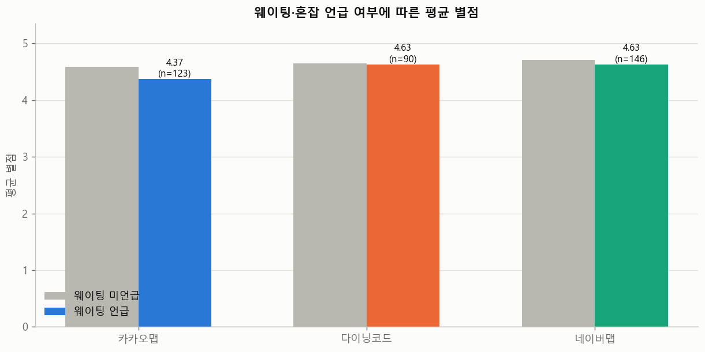

| 사이트 | 웨이팅 언급률 | 언급 리뷰 평균 | 미언급 리뷰 평균 | 차이 |
|---|---:|---:|---:|---:|
| 카카오맵 | 24.6% | 4.37 | 4.59 | -0.22 |
| 다이닝코드 | 29.1% | 4.63 | 4.65 | -0.02 |
| 네이버맵 | 29.3% | 4.63 | 4.71 | -0.08 |

- 웨이팅 언급 리뷰의 별점은 세 사이트 모두 더 낮았습니다.
- 차이는 카카오맵에서 0.22점으로 가장 컸고, 다이닝코드는 0.02점으로 거의 없었습니다.
- 단순 평균 비교이므로 웨이팅이 별점 하락의 원인이라고 단정할 수는 없습니다.


## DB, Docker, AWS 과제 

### MongoDB 데이터 전처리 자동화

#### 구현 개요

리뷰 크롤링 데이터(diningcode, navermap, kakaomap)를 MongoDB에 저장하고, `POST /review/preprocess/{site_name}` API를 통해 전처리 및 Feature Engineering을 자동화했습니다. 기존 CSV 기반으로 구현되어 있던 전처리 클래스들을 MongoDB 입출력 구조로 리팩터링하는 방식으로 진행했습니다.


#### 데이터 흐름

1. **원본 데이터 저장**: 크롤링된 CSV(rating, date, content 등)를 `site_name` 필드와 함께 `raw_reviews` 컬렉션에 저장. 하나의 컬렉션에 세 사이트 데이터를 모두 담고 `site_name` 필드로 구분하는 방식을 채택했습니다. (사이트별로 컬렉션을 분리하는 대신, 조회 시 `{"site_name": "..."}` 필터 하나로 처리할 수 있어 API 설계가 단순해집니다.)

2. **API 요청**: `POST /review/preprocess/{site_name}` 호출 시, 경로 파라미터로 받은 `site_name`에 따라 해당 사이트 전용 프로세서 클래스를 선택합니다 (`PROCESSOR_MAP`으로 매핑).

3. **전처리 및 Feature Engineering**: 각 프로세서는 결측치/이상치 제거텍스트 정제, 날짜 파싱, TF-IDF 벡터화 등 사이트별로 이미 구현되어 있던 로직을 그대로 수행합니다. 기존에는 이 로직들이 로컬 CSV 파일을 입출력으로 사용했으나, MongoDB의 조회 결과(`dict` 리스트)를 입력받고 MongoDB 컬렉션에 결과를 저장하는 구조로 리팩터링했습니다.

4. **결과 저장**: 처리된 결과는 `processed_reviews` 컬렉션에 저장되며, 재요청 시 중복 저장을 방지하기 위해 저장 직전 동일 `site_name`의 기존 데이터를 삭제한 뒤 새로 삽입합니다.

#### 주요 파일

| 파일 | 역할 |
|---|---|
| `database/mongodb_connection.py` | MongoDB 클라이언트 연결 |
| `app/review/review_router.py` | `POST /review/preprocess/{site_name}` API 엔드포인트 |
| `review_analysis/preprocessing/diningcode_processor.py` | DiningCode 리뷰 전처리 |
| `review_analysis/preprocessing/navermap_processor.py` | NaverMap 리뷰 전처리 |
| `review_analysis/preprocessing/kakaomap_processor.py` | KakaoMap 리뷰 전처리 |


#### API 응답 예시

**성공 (200)**
```json
{
  "status": "success",
  "site_name": "diningcode",
  "processed_count": 308
}
```

**지원하지 않는 site_name (400)**
```json
{
  "detail": "지원하지 않는 site_name입니다: hello"
}
```

#### 문제와 해결 과정

##### 데이터 재처리 시 중복 삽입 문제

API를 여러 번 호출해 테스트하는 과정에서, `processed_reviews` 컬렉션에 같은 사이트 데이터가 중복으로 쌓이는 것을 발견했습니다. `insert_many()`는 기존 데이터를 지우지 않고 단순히 추가만 하기 때문입니다.

해결: 저장 직전에 `collection.delete_many({"site_name": site_name})`로 기존 데이터를 먼저 삭제한 뒤 `insert_many()`를 수행하도록 수정했습니다. 이를 통해 API를 몇 번을 호출해도 결과가 항상 동일하게 유지되는 **멱등성**을 확보했습니다.

> **개념 정리 — 멱등성:**
> 동일한 요청을 여러 번 수행해도 결과가 달라지지 않는 성질을 말합니다.
> REST API 설계에서 `POST`는 원래 멱등하지 않은 것이 일반적이지만
> (호출할 때마다 새 리소스가 생성됨), 이번 전처리 API처럼 "최신 상태로
> 갱신"하는 것이 목적인 경우에는 재호출 시에도 동일한 결과가 나오도록
> 설계하는 것이 안전합니다. 특히 여러 사람이 같은 API를 테스트하거나,
> CI/CD 파이프라인에서 반복 실행될 가능성이 있는 엔드포인트라면
> 멱등성을 고려하는 것이 중요합니다.

### Docker Hub

https://hub.docker.com/r/ryulha/dbgit_test

### AWS API 실행 결과

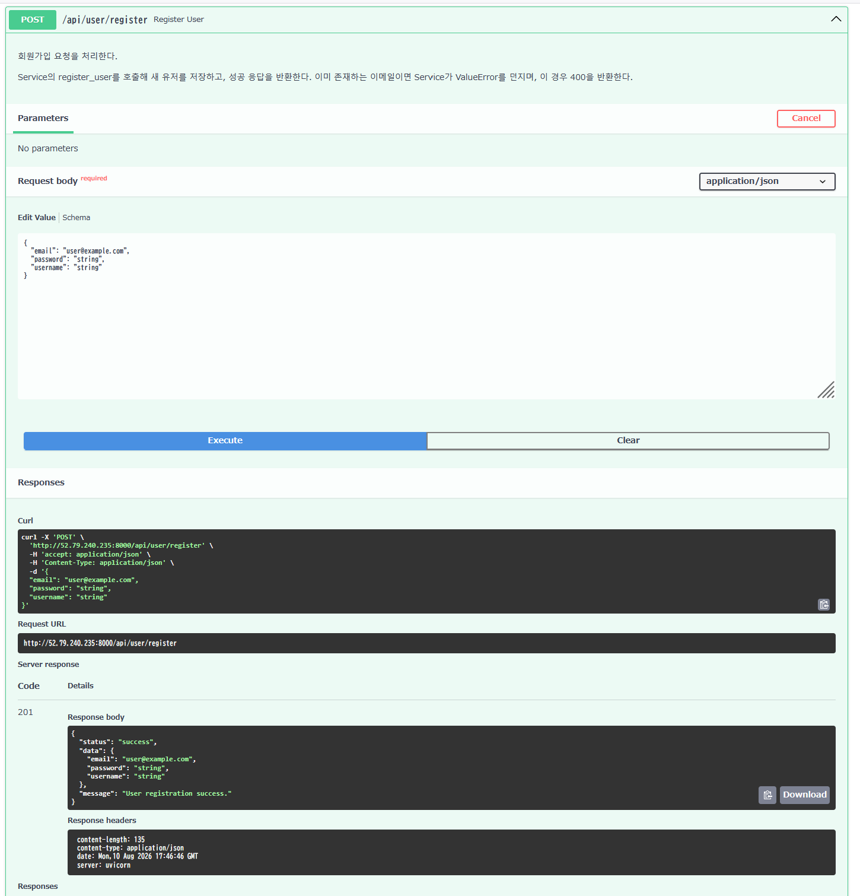

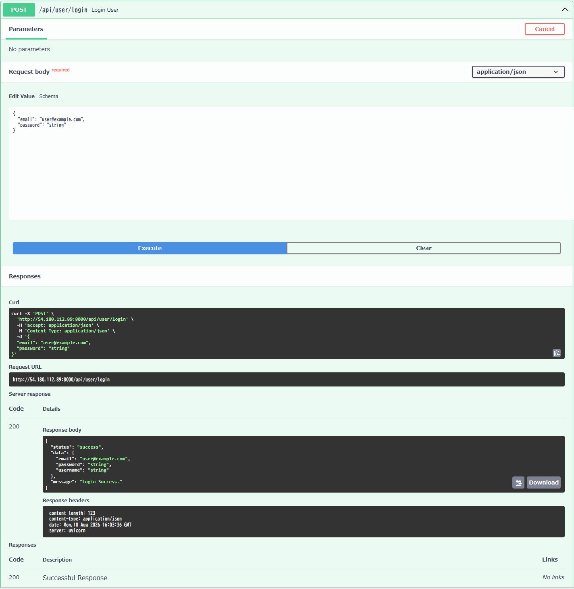

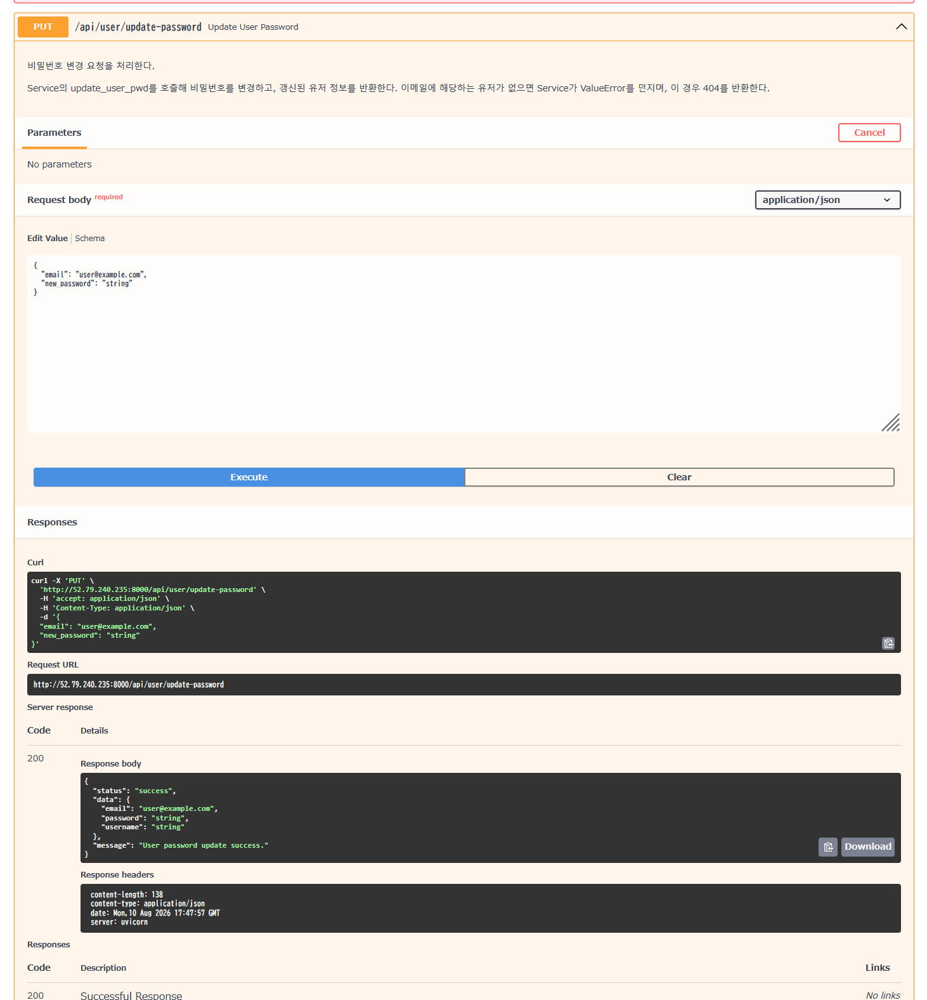

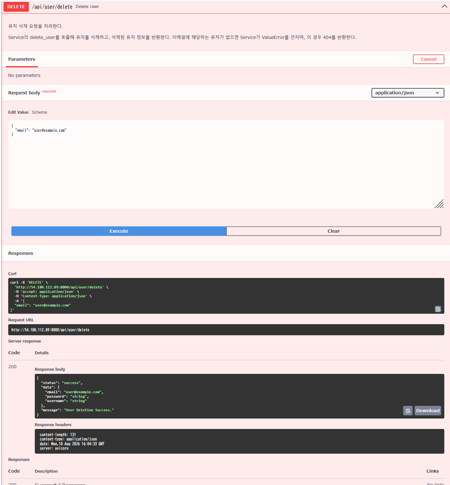

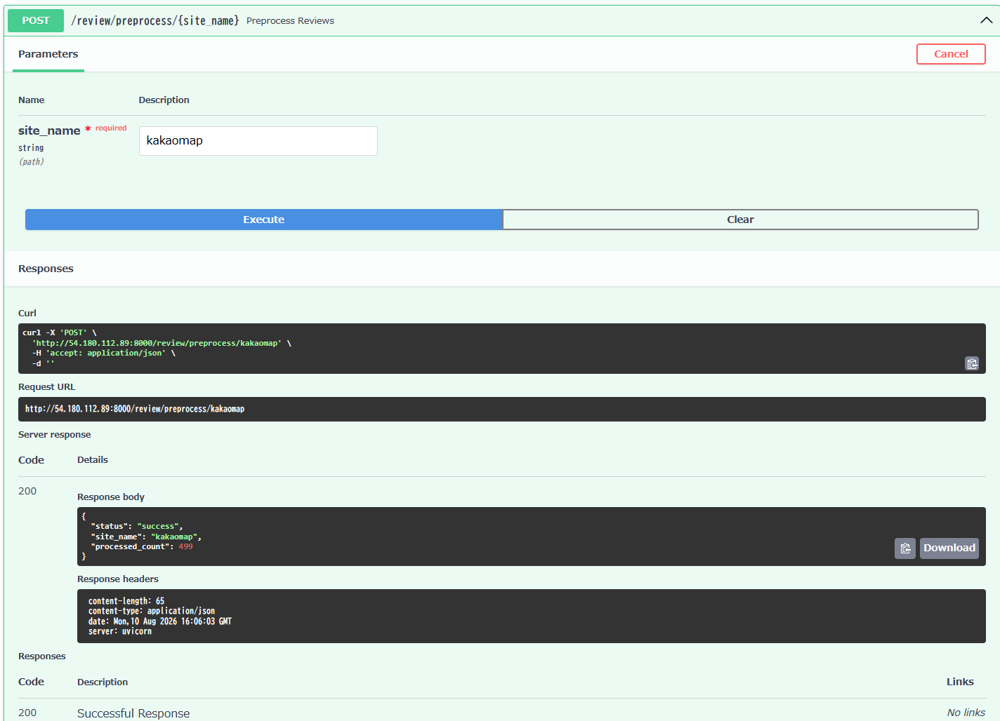

### GitHub Actions 실행 결과

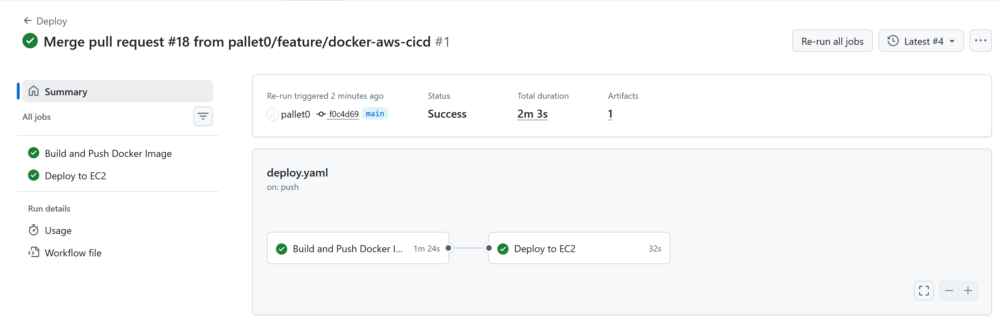

## AI Agent 과제

### Architecture

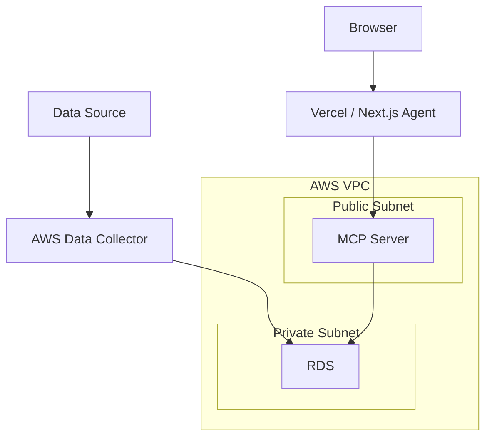
```mermaid
flowchart TD
    source[Data Source] --> collector[AWS Data Collector]
    collector --> rds
    browser[Browser] --> vercel[Vercel / Next.js Agent]
    vercel --> mcp
    mcp --> rds

    subgraph vpc[AWS VPC]
        subgraph public[Public Subnet]
            mcp[MCP Server]
        end
        subgraph private[Private Subnet]
            rds[RDS]
        end
    end
```

### MCP

MCP Server는 Tool, Service, Repository를 분리해 구성했습니다.

```text
MCP Tool
  → Service
    → Repository
      → RDS
```

| Tool | 설명 |
|---|---|
| `get_latest_data(limit)` | 최근 수집된 리뷰를 조회합니다. |
| `search_data(keyword, start_date, end_date, limit)` | 키워드와 기간으로 리뷰를 검색합니다. |
| `get_statistics(column)` | 리뷰 별점의 평균, 최솟값, 최댓값, 개수를 조회합니다. |

조회 SQL은 `mcp_server/repositories/data_repository.py`에서만 작성합니다. Service는 입력값을 검증하고, MCP Tool은 Service를 호출합니다. 새로운 Tool을 추가할 때도 Repository에 조회 기능을 추가하고 Service를 거쳐 `server.py`에 등록합니다.

Repository에서는 parameterized query를 사용하고 조회 결과는 최대 100개로 제한합니다. DB 연결과 조회 timeout은 5초이며 날짜 형식과 통계 컬럼을 검증합니다.

### MCP Security

- MCP는 SELECT 권한만 가진 `mcp_user`로 RDS에 연결합니다.
- RDS는 Private Subnet에 두고 MCP Server의 Security Group에서만 DB 포트 접근을 허용합니다.
- MCP Server는 Public Subnet의 EC2에서 실행하고 내부 애플리케이션 포트는 인터넷에 직접 공개하지 않습니다.
- 외부 요청은 Reverse Proxy를 거쳐 MCP Server로 전달합니다.
- MCP 요청은 `Authorization: Bearer <MCP_AUTH_TOKEN>`으로 인증합니다.
- DB Credential과 MCP Token은 환경변수로 관리하며 Docker Image에 포함하지 않습니다.
- Browser는 MCP를 직접 호출하지 않고 Vercel의 Next.js Server를 통해 호출합니다.

### MCP Docker

```bash
docker build -f mcp_server/Dockerfile -t ybigta-mcp .
docker run --env-file .env -p 127.0.0.1:8000:8000 ybigta-mcp
```

MCP 엔드포인트는 `/mcp`입니다.

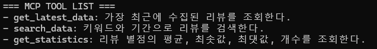

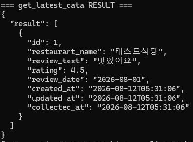
